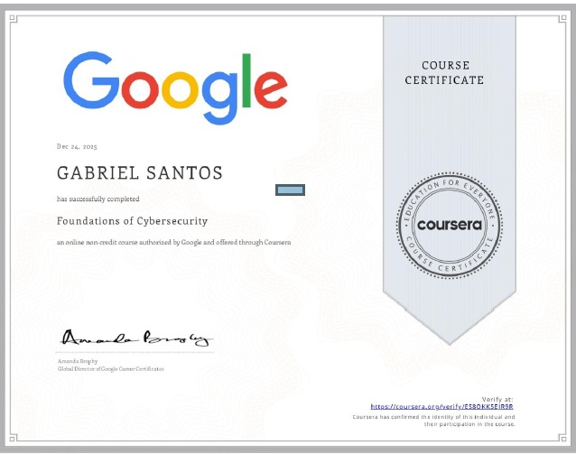

# 🛡️ Certificados — Cibersegurança

## 🎓 Google Cybersecurity Professional Certificate — Course 1

- **Plataforma:** Coursera / Google  
- **Status:** Concluído (Course 1)  
- **Foco:** Fundamentos de segurança, redes, SIEM, IDS, NIST CSF, OWASP, malware e phishing.
